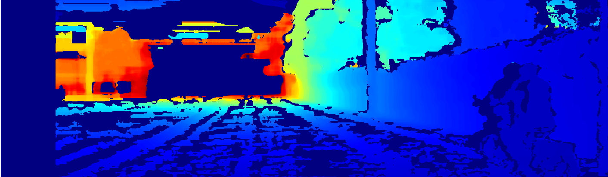
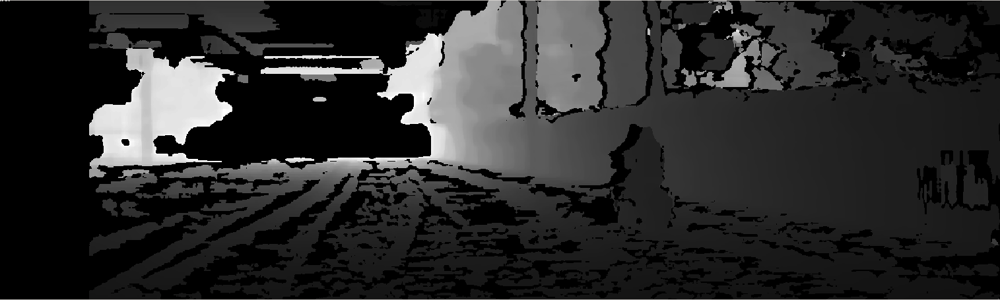

# Stereo Vision Depth Estimation
Depth map from KITTI stereo camera feeds using ROS2 and OpenCV.

## Demo


## What it does

This project processes synchronized stereo camera feeds from KITTI dataset to generate accurate depth maps. The system extracts camera calibration from ROS topics, performs stereo matching using StereoSGBM, and converts disparity to real-world depth measurements with colorized visualization.

## How I built
**Depth Processing:** Developed disparity-to-depth conversion with outlier filtering using StereoSGBM algorithm
**ROS2 Stereo Pipeline:** Built synchronized stereo processing node using message filters for precise timestamp alignment between left and right camera streams

## What I learned

Working with stereo vision taught me about camera calibration importance and timestamp synchronization challenges. The main challenge was achieving real-time performance while maintaining accuracy, solved through optimized StereoSGBM parameters and efficient message filtering.


## Visualize Images and Point Clouds
bag playback + processing node + visualization
**Build and Source:**
```bash
colcon build --packages-select hands_on_kitti
source install/setup.bash
```
Select `/kitti/camera_color_left/image_raw` from dropdown.

**Run:**
```bash
ros2 launch hands_on_kitti my_node_launch.py
```

**Data Structure**
```bash
# Show the structure of any ros2 msg types
ros2 interface show tf2_msgs/msg/TFMessage
```
